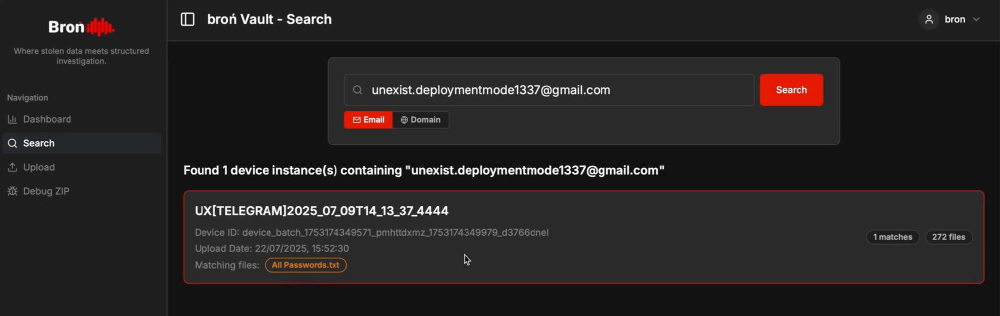
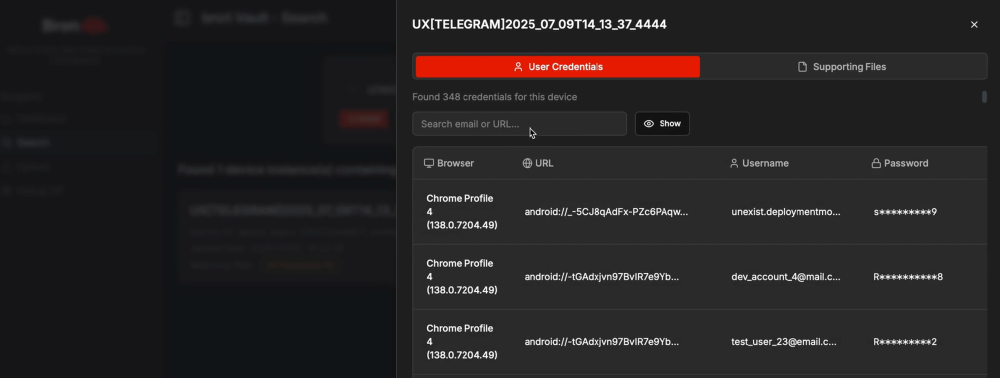
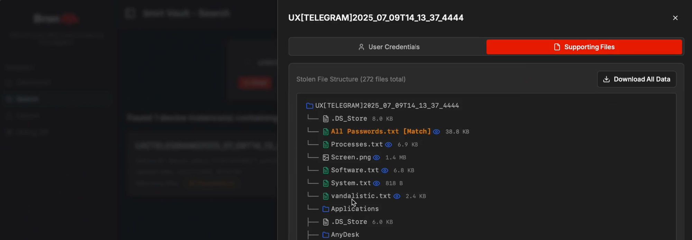

# Broń Vault

Broń Vault is an open-source stealer logs dashboard designed to simplify the process of analyzing stealer log data. 

> 💡 If you're new to this concept, we recommend reading our introductory article on our blog: ['Stealer Logs: Perspectives on Attack and Defense in a Silent Epidemic, and How Broń Vault Automates the Parsing Process'](https://blog.intellibron.io/stealer-logs-perspectives-on-attack-and-defense-in-a-silent-epidemic-and-how-bron-vault-automates-the-parsing-process/).

Forget complex ad-hoc scripts. With Broń Vault, you can simply drag and drop `.zip` log files into the web interface. The application automatically parses the data and presents it in a structured format, ready for inspection.

Our goal is to support the day-to-day needs of security teams on the front lines by providing a practical alternative to manual scripting or overly complex platforms typically required for stealer log analysis. This project reflects our mission to democratize security, making foundational analysis capabilities accessible to everyone and allowing analysts to focus on critical decision-making instead of manual log parsing.

> ⚠️ **Note:** This tool was developed as a side project and is not intended for production use. Please see the [Important Notice](#important-notice) section below.


-----

## Key Features

  * **File Upload & Processing**: Upload `.zip` files containing common stealer log formats with real-time upload progress tracking and detailed logging.
    
  * **Advanced Search**: Instantly find credentials and pivot to the full context of the breach.
    - Search by specific email addresses or entire domains across all logs.
    - A successful match reveals a "Supporting Files" tab with all data from the same device.
    - Seamlessly explore correlated cookies, browser history, and system files in a single click.

  * **Domain Discovery**: Search for subdomains, paths, and associated credentials for any domain across all uploaded logs.
    - Enter a domain to discover all related subdomains, paths, and exposed credentials.
    - **Overview Tab**: 
      - Timeline visualization showing when credentials were logged by stealers (log-date tracking).
      - Top 10 subdomains by credential volume with horizontal bar charts.
      - Top 10 paths by credential volume with horizontal bar charts.
      - Summary statistics showing total subdomains, paths, credentials, reused credentials, and affected devices.
    - **Subdomains Tab**: Browse all discovered subdomains with associated paths and credential counts. Includes deduplication feature that aggregates subdomains for clearer insights, automatically summing credential counts when multiple paths exist for the same subdomain.
    - **Credentials Tab**: View all credentials associated with the domain, including URLs, usernames, passwords, log dates, and direct links to correlated devices.

  * **Device Detail View**: Explore individual device information with comprehensive details.
    - **Overview Tab**: Get an at-a-glance summary with engaging visualizations including:
      - Summary cards showing total credentials, software, and files
      - Device overview with key system information (OS, CPU, GPU, RAM, etc.)
      - Top passwords visualization (polar area chart)
      - Top domains distribution (horizontal bar chart)
      - File size distribution analysis
    - **Host Information Tab**: View detailed system information extracted from logs of multiple stealer families
    - **User Credentials Tab**: Browse all credentials associated with the device
    - **Software Installed Tab**: See all installed software detected on the device
    - **Files Tab**: Explore the complete file structure with tree viewer

  * **Statistical Dashboard**: Get a strategic overview of the data through clear visualizations, including:
      - Total domains and URLs (including IPs)
      - Total credentials
      - Total files extracted
      - Top 5 most common passwords
      - Top 10 TLDs
      - Top 10 most affected browsers
      - Top 10 most used software
        
  * **Debug-Zip Utility**: Perform a quick check on `.zip` files to analyze their internal structure, ensure they match supported formats, and flag directories missing a password file.
    
  * **Simple RSS Feeds**: Integrated RSS feeds from **ransomware.live** and **malware-traffic-analysis.net** to keep you updated on the latest threats.
  







-----

## Important Notice

- This tool was built with a focus on functionality, not hardened security. Do **NOT** deploy this in production environment or expose it to public networks. Use it exclusively in a secure, **isolated** environment.
- Broń Vault was developed by [Tomi Ashari](https://github.com/mastomii) and [YoKo Kho](https://github.com/yokokho) as a side project under the [ITSEC Asia](https://itsec.asia/) RnD Division, with support from AI-assisted tooling. It does not represent our commercial [IntelliBroń Threat Intelligence](https://intellibron.io/) platform, though it reflects some similar capabilities.

-----

## Getting Started

Follow these steps to get Broń Vault up and running locally.

### Prerequisites

  * Node.js & npm
  * MySQL (or use Docker for an easier setup)

### Tested Environments

This application has been successfully tested on the following operating systems:

  * Ubuntu 24.04 LTS
  * macOS Sequoia
  * Windows 11 Pro

### Installation & Running

1.  **Clone this repository:**

    ```bash
    git clone https://github.com/your-username/bron-vault.git
    cd bron-vault
    ```

2.  **Install dependencies:**

    ```bash
    npm install
    ```

3.  **Configure the Environment:**

      * Copy `.env.example` to `.env.local`.
      * Update `.env.local` with your MySQL database connection details.

4.  **Run the development server:**

    ```bash
    npm run dev
    ```

### Initial Setup

Once the server is running, perform this one-time setup:

1.  Open `http://localhost:3000` in your browser.
2.  The app will automatically detect that no users exist and will direct you to create an account.
3.  Create your first **administrator** account.
4.  Log in with your newly created credentials.

You are now ready to start using Broń Vault\!
Just upload the stealer logs, and it will automatically parse them.

-----

## Contributing

If you'd like to improve the project, whether by contributing code or reporting issues and security findings, **your feedback is always welcome**.
